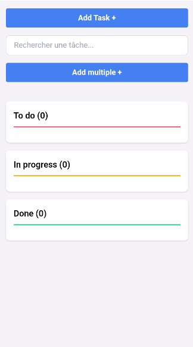
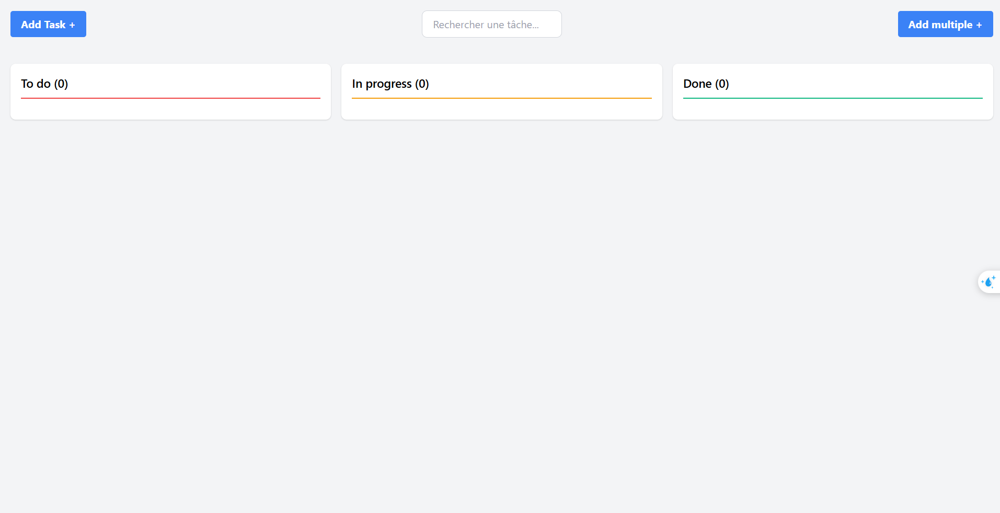

<!-- Images de l'interface desktop et mobile -->

  
  

<!-- En-tête avec titre et GIF -->

  <h1 style="margin-right: 20px;">📋 Workflow du Projet</h1>
  

<h2>📝 Étapes du Projet</h2>

<h3>1. 🎯 Planifier mes tâches sur Projet Github</h3>

Organisation et suivi des tâches du projet via Github Projects

<h3>2. ⚙️ Installation et configuration de l'environnement dans VS Code</h3>

Installation du package Tailwind CSS selon la documentation officielle, comme la photo que je partage

<h3>3. 📁 Creation Repo sur Github avec First push</h3>

Premier push contenant les packages nécessaires

<h3>4. 🔒 Creation .gitignore</h3>

Configuration pour masquer les packages

<h3>5. 🔑 Configurer SSH key dans Github</h3>

Mise en place de l'authentification sécurisée

<h3>6. 👁️ Cacher .gitignore</h3>

Masquage des fichiers sensibles

<h3>7. 🎨 Integration de l'interface</h3>

Développement avec HTML et Tailwind CSS

  
  
  
  
  
  
  

<h3>8. 🔄 Interaction de la page avec l'utilisateur</h3>

Fonctionnalités JavaScript :

<ul>
  <li>🔄 Dragging : Déplacement des tâches entre colonnes</li>
  <li>✅ Alert Delete Success</li>
  <li>📊 Count Task par type (To do, In progress, Done)</li>
  <li>🔍 Recherche sur titre du task</li>
  <li>🎨 Couleur spécifique par propriété</li>
  <li>🛠️ Accès utilisateur pour Modifier/Delete</li>
</ul>
